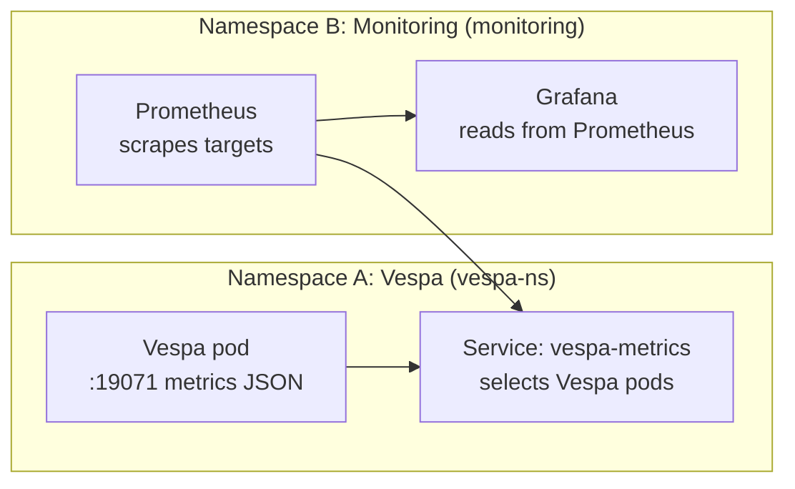
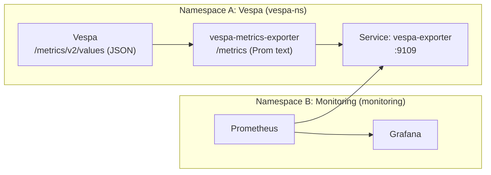

### Vespa monitoring in Kubernetes (Prometheus + Grafana in a different namespace) — beginner guide

You have:

- **Vespa** running in namespace **A** (example: `vespa-ns`)
- **Prometheus + Grafana** running in namespace **B** (example: `monitoring`)
  - currently monitoring vLLM

Yes — you can “link” them so the same Prometheus/Grafana monitors Vespa too.

The key idea:

- **Prometheus scrapes** (pulls) metrics over HTTP from targets in the cluster.
- **Grafana reads** metrics from Prometheus and visualizes them.

Kubernetes networking is cluster-wide, so cross-namespace scraping is normal.

---

## 0) One important gotcha (very important)

Vespa’s built-in metrics endpoint is usually:

- `http://<vespa-host>:19071/metrics/v2/values`

This endpoint returns **JSON**, not Prometheus “text format”.

So in practice you do one of these:

- **Best (common)**: use an **exporter** that converts Vespa JSON → Prometheus text `/metrics`
- **Sometimes**: use an existing system that can scrape JSON (less common)

In this repo, see the Docker example exporter pattern in `rag_app/vespa-metrics-exporter/`.

---

## 1) Architecture diagrams (simple)

### 1.1 Cross-namespace scraping (high-level)



### 1.2 With an exporter (recommended)



---

## 2) Quick checklist (before you write YAML)

To scrape across namespaces, the cluster must allow:

- **Network access**
  - no NetworkPolicy blocking Prometheus → Vespa (or → exporter)
- **Discovery permissions**
  - if using Prometheus Operator, Prometheus needs RBAC to “see” Services/Endpoints in `vespa-ns`

If scraping fails, it’s usually one of these:
- wrong Service selector labels (Service doesn’t point to Vespa pods)
- wrong port name in ServiceMonitor
- RBAC denies listing Services/Endpoints in the other namespace
- NetworkPolicy blocks traffic

---

## 3) The recommended approach (Operator): Service + ServiceMonitor

This section assumes you use **Prometheus Operator** (common in clusters).

### Step 1: Expose a scrape target in the Vespa namespace

You have two choices:

#### Choice A (recommended): exporter Service (Prometheus text `/metrics`)
Expose the exporter (example port 9109) using a Service.

#### Choice B (advanced): scrape Vespa JSON directly
Only do this if your monitoring stack supports it (most Prometheus setups don’t).

### Step 2: Create a ServiceMonitor in the monitoring namespace

Prometheus Operator discovers targets via `ServiceMonitor`.
The important part is: **tell it to look in the Vespa namespace**.

Example `ServiceMonitor` (for an exporter Service):

```yaml
apiVersion: monitoring.coreos.com/v1
kind: ServiceMonitor
metadata:
  name: vespa-exporter
  namespace: monitoring
spec:
  namespaceSelector:
    matchNames:
      - vespa-ns
  selector:
    matchLabels:
      app: vespa-exporter
  endpoints:
    - port: metrics
      path: /metrics
      interval: 15s
```

What you must match:
- `namespaceSelector.matchNames`: the namespace where your Service lives (Vespa/exporter namespace)
- `selector.matchLabels`: labels on that Service
- `endpoints.port`: **the Service port name**, not the number

### Step 3: Verify from Prometheus UI

In Prometheus:
- Targets page should show “UP” for the Vespa exporter target.

---

## 4) The “plain Prometheus” approach (no Operator)

If your colleague runs Prometheus with a config file, they can add a scrape job.

The simplest stable target is a Service DNS name:

`<service>.<namespace>.svc.cluster.local`

Example idea (exporter):
- `http://vespa-exporter.vespa-ns.svc.cluster.local:9109/metrics`

They would add a `scrape_configs` job (exact YAML depends on their Prometheus installation).

---

## 5) What should you actually do (best recommendation)

If your colleague already has Prometheus/Grafana running for vLLM:

1. Deploy a **Vespa metrics exporter** (sidecar or separate Deployment) in the Vespa namespace
2. Expose it with a **Service**
3. Add a **ServiceMonitor** (Prometheus Operator) or **scrape job** (plain Prometheus)
4. Import/build a Grafana dashboard for:
   - query latency (p95)
   - QPS
   - error rate
   - memory usage / OOM risk

This is the clean, scalable, “production style” way.

---

## 6) What I need from you to generate exact YAML for your cluster

Reply with:

- **Vespa namespace name** (example: `vespa-ns`)
- **Monitoring namespace name** (example: `monitoring`)
- Do you have **Prometheus Operator**? (Do you see `ServiceMonitor` resources?)
- Do you prefer exporter as **sidecar** (same pod) or **separate Deployment**?


