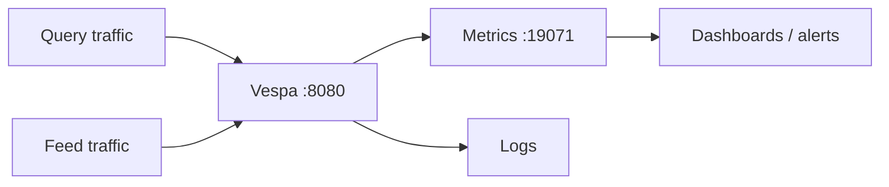

### Vespa Performance Monitoring Guide (practical, copy/paste)

This document shows how to **monitor Vespa performance** in a way that’s useful for production-like workloads:

- **Query performance** (latency, throughput, tail latency)
- **Feed performance** (ingest rate, backpressure, failures)
- **Resource usage** (CPU, memory, disk, container limits)
- **Debugging slow queries** (trace / profiling)
- **What “good” looks like** and what to do when it’s not good

It’s written to work with the local Docker setup in this repo, but the same ideas apply to real clusters.

---

### 0) Big picture (what you monitor and why)



If you only monitor one thing, monitor **p95 query latency** and **error rate**.

---

### 1) Key performance terms (short glossary)

- **Latency**: time for one request (example: 30 ms).
- **Throughput**: requests per second (QPS).
- **Tail latency**: p95 / p99 latency (slowest 5% / 1% of requests).
- **Error rate**: percentage of requests failing (HTTP 4xx/5xx).
- **Backpressure**: Vespa slowing down or rejecting feed when it’s overloaded.
- **Saturation**: CPU/memory/disk is maxed out → everything gets slower.

---

### 2) The most important KPIs to track

#### 2.1 Query KPIs

- **p50 / p95 / p99 query latency**
- **QPS** (queries per second)
- **Error rate** (HTTP errors + Vespa query errors)
- **Time spent where**:
  - nearest neighbor (ANN) work
  - ranking work
  - summary fetching (returning fields)

#### 2.2 Feed (ingest) KPIs

- **documents/sec** fed successfully
- **feed latency**
- **failed operations**
- **retries / throttling**

#### 2.3 System KPIs

- **CPU usage** (sustained high CPU correlates with latency spikes)
- **Memory usage** (and whether it’s growing)
- **Disk IO / disk usage** (especially if you update/delete a lot)

---

### 3) Quick checks you can run right now

#### 3.0 If Vespa is running in Kubernetes (run checks from inside the pod)

In Kubernetes, you often **cannot reach** Vespa’s internal ports directly from your laptop.
Two common approaches:

- **Option A (recommended for debugging)**: `kubectl exec` into the Vespa pod and curl `localhost`
- **Option B**: `kubectl port-forward` a port to your laptop temporarily

First, find the pod:

```bash
kubectl get pods -A | grep -i vespa
```

If you know the namespace already (recommended):

```bash
kubectl -n <NAMESPACE> get pods | grep -i vespa
```

> Tip: if your pod has multiple containers, add `-c <container-name>` to `kubectl exec`.

**From inside the pod**, these endpoints usually work on localhost:

- Health: `http://localhost:19071/state/v1/health`
- Metrics: `http://localhost:19071/metrics/v2/values`
- Query/Document API: `http://localhost:8080/`

Example commands:

```bash
# Health check (inside pod)
kubectl -n <NAMESPACE> exec -it <VESPA_POD_NAME> -- curl -fsS http://localhost:19071/state/v1/health

# Metrics JSON (inside pod)
kubectl -n <NAMESPACE> exec -it <VESPA_POD_NAME> -- curl -fsS http://localhost:19071/metrics/v2/values | head -n 50
```

If you prefer running curls from your laptop, port-forward:

```bash
# Forward Vespa query+document API
kubectl -n <NAMESPACE> port-forward pod/<VESPA_POD_NAME> 8080:8080

# Forward Vespa metrics/control port
kubectl -n <NAMESPACE> port-forward pod/<VESPA_POD_NAME> 19071:19071
```

Then use the same curl commands as Docker/local, but against your laptop:

```bash
curl -fsS http://localhost:19071/state/v1/health
curl -fsS http://localhost:19071/metrics/v2/values > metrics.json
```

If your Prometheus/Grafana is in another namespace and you want to scrape Vespa “the right way”, see:
- `VESPA_KUBERNETES_PROMETHEUS_GRAFANA_GUIDE.md`

#### 3.1 “Is Vespa up?”

```bash
curl -s http://localhost:19071/state/v1/health
```

You want a healthy response (HTTP 200).

#### 3.2 Get Vespa metrics (built-in)

Vespa metrics endpoint:

- `http://localhost:19071/metrics/v2/values`

Fetch to a file:

```bash
curl -s "http://localhost:19071/metrics/v2/values" > metrics.json
```

Now you can search it:

```bash
grep -i -E "query|latency|feed|proton|hnsw|memory|cpu" metrics.json | head -n 50
```

Notes:

- Metric names can differ by Vespa version and config.
- The practical approach is: **pull the JSON and grep/jq for what you need**.

#### 3.3 Container resource usage (Docker)

```bash
docker stats vespa
```

Watch CPU% and MEM usage while running queries.

---

### 4) Measuring query latency (client-side)

This measures end-to-end HTTP time (includes network + server work):

```bash
curl -s -o /dev/null -w "time_total=%{time_total}\n" \
  -H "Content-Type: application/json" \
  -d '{"yql":"select * from sources chunk where ({targetHits:10}nearestNeighbor(embedding, q));","hits":10,"ranking.profile":"vector","input.query(q)":[0.01,0.02,0.03]}' \
  "http://localhost:8080/search/"
```

Run it multiple times and look for stability.

---

### 5) Load testing (throughput + tail latency)

If you have `hey` installed, this is a quick way to see p95/p99 and QPS:

```bash
hey -n 2000 -c 20 -m POST -H "Content-Type: application/json" \
  -d '{"yql":"select * from sources chunk where ({targetHits:10}nearestNeighbor(embedding, q));","hits":10,"ranking.profile":"vector","input.query(q)":[0.01,0.02,0.03]}' \
  http://localhost:8080/search/
```

What to look for:

- If **p95 grows a lot** when concurrency increases, you are hitting saturation (CPU or memory).
- If **error rate increases**, you are overloaded or misconfigured.

---

### 6) Debugging slow queries (trace / profiling)

Tracing helps answer: “where did the time go?”

```bash
vespa query \
  'yql=select * from sources chunk where ({targetHits:10}nearestNeighbor(embedding, q));' \
  'input.query(q)=[0.01,0.02,0.03]' \
  'ranking.profile=vector' \
  'tracelevel=3'
```

Typical causes of slowness:

- **Returning large fields** (big `text` summaries) → summary fetch becomes expensive
- **High `targetHits`** with ANN → more work per query
- **Too many filters** or slow attribute lookups (depends on schema)
- **CPU saturation** (most common in single-node Docker)

Practical tip:

- First reduce output fields: return only `chunk_id` and `doc_id` and see if latency improves.

---

### 7) Monitoring feed performance

If you feed using:

```bash
vespa feed feed.jsonl
```

Then monitor:

- CLI output for failures/retries
- `metrics.json` for feed/ingest related counters
- container CPU/memory during feed

If feed slows down a lot while queries are running, you are likely resource-limited (single node).

---

### 8) What affects vector query performance (simple explanations)

- **`hits`**: number of results returned.
- **`targetHits`**: how many candidates ANN should find before ranking.
  - higher targetHits → usually better recall, but slower queries.
- **Vector dimension**: larger vectors → more compute, bigger memory.
- **HNSW config**:
  - affects index size, build cost, and query behavior

Rule of thumb for beginners:

- keep `hits` small (5–20)
- set `targetHits` around 2–10x `hits` as a starting point

---

### 9) Alerts (what to alert on)

For a production system, good starter alerts:

- **p95 query latency** above a threshold (for 5–10 minutes)
- **error rate** above a threshold
- **CPU** > 85% sustained
- **memory** near container limit
- **disk** usage too high (and growing)

Even locally, these help you learn what “healthy” looks like.

---

### 10) When deletes/updates are heavy (extra monitoring)

If your workload includes lots of updates/deletes (“churn”), also watch:

- disk usage trends
- query latency stability over time
- background maintenance effects (you may see periodic spikes)

Remember:

- “Document disappears from results” can be fast
- “Storage fully reclaimed” can be slower (background work)

---

### 11) Next improvements (optional)

If you want “real dashboards”:

- scrape Vespa metrics and view them in a dashboard tool (Prometheus/Grafana style)
- set alerts for p95 latency, error rate, and saturation

If you tell me your environment (Docker only vs Kubernetes vs VMs), I can add a dedicated section with the exact steps for that setup.


