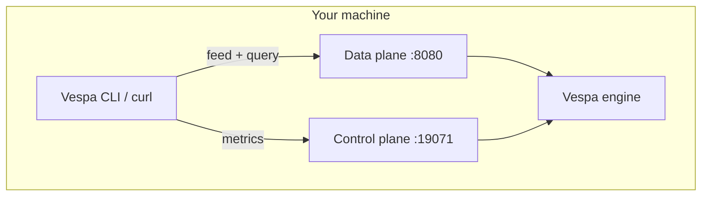
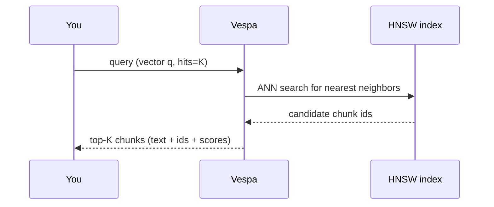
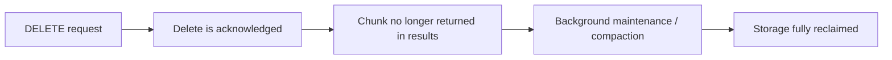

### Vespa Vector Store — Beginner Guide (for junior LLM engineers)

This document is a simpler, “explain like I’m new” guide to using **Vespa** as a **vector store**.

- It explains **what is happening**, not only “what command to run”.
- It defines technical terms in a friendly **glossary**.
- It includes **architecture diagrams** you can view directly on GitHub (Mermaid).

If you want the more complete/advanced version, read: `VESPA_VECTOR_STORE_TUTORIAL.md`.

---

### 0) Big picture: what you are building

You are building a system for **retrieval** (finding relevant text chunks) that looks like this:

```mermaid
flowchart LR
  A[Your data: PDFs / pages / notes] --> B[Chunker]
  B --> C[Embedding model]
  C -->|vector + text| D[Vespa]
  Q[User question] --> E[Query embedding]
  E -->|vector| D
  D --> F[Top-K matching chunks]
  F --> G[LLM prompt (RAG)]
```

**Key idea**: the LLM does not “search the internet”. It searches your stored chunks using **vector similarity**.

---

### 1) What is a “vector store” (in simple words)?

A **vector store** is a system that:

- stores **chunks** of text (small pieces of documents)
- stores an **embedding** (a list of numbers) for each chunk
- can quickly find the **most similar chunks** to a query embedding

When people say “vector database”, they often mean the same thing.

---

### 2) Important terms (mini-glossary)

You’ll see these words everywhere; here’s what they mean:

- **chunk**: a small piece of a document (for example 200–500 tokens). In Vespa, a chunk is typically one **document**.
- **document** (Vespa document): one stored record. Example: one chunk + its fields.
- **field**: a property inside a document (example: `text`, `doc_id`, `embedding`).
- **embedding**: a vector of numbers that represents meaning (semantic representation) of text.
- **vector**: a list/array of numbers, like `[0.12, -0.03, ...]`.
- **dimension**: the length of the vector (example: 384, 768, 1536).
- **similarity**: a measure of “how close” two vectors are. Common choices:
  - **cosine similarity** (often implemented as angular distance)
  - **dot product**
  - **euclidean distance**
- **ANN** (Approximate Nearest Neighbor): faster search that may be “almost correct” but very fast.
- **HNSW**: a popular ANN index structure used to speed up vector search.
- **index**: a data structure that makes search fast (like a book index).
- **attribute** (Vespa attribute): field stored in a way that can be accessed fast for filtering/ranking (often in memory).
- **text index**: index for keyword search (BM25).
- **BM25**: a classic keyword relevance scoring function for text search.
- **hybrid search**: combining keyword score (BM25) + vector similarity.
- **rank / ranking**: how Vespa sorts results (the scoring formula).
- **rank profile**: a named ranking configuration (example: `vector`, `hybrid`).
- **YQL**: Vespa’s query language string (like SQL for search).
- **Top-K**: return the best K results (e.g., `hits=10`).
- **latency**: how long one query takes.
- **throughput**: how many queries per second you can handle.
- **p95 / p99**: “tail latency” — 95% (or 99%) of requests are faster than this number.

Don’t worry if you don’t remember everything; you can come back to this section.

---

### 3) What runs where? (Vespa architecture)

Vespa has two main “planes” you will interact with locally:

- **Data plane** (port `8080`): feed documents + run queries
- **Control plane** (port `19071`): metrics, config, status



---

### 4) Step-by-step tutorial (copy/paste)

This repo already contains an example Vespa app package:

- `my-vespa-app/`
  - `services.xml` (what services to run)
  - `schemas/chunk.sd` (your schema and vector config)

#### 4.1 Start Vespa (Docker)

```bash
docker run --detach --name vespa --hostname vespa \
  --publish 8080:8080 --publish 19071:19071 \
  vespaengine/vespa
```

If you ever want to stop it:

```bash
docker stop vespa
```

#### 4.2 Deploy your Vespa “application package”

Install Vespa CLI (macOS):

```bash
brew install vespa-cli
```

Point the CLI to the local container:

```bash
vespa config set target local
```

Deploy:

```bash
vespa deploy --wait 300 ./my-vespa-app
```

**What just happened (in simple words)?**

- You told Vespa: “here is my schema (document type, fields, and vector index config). Please start using it.”

#### 4.3 Feed (upload) some chunk documents

This repo includes a helper script that generates a JSONL feed file:

```bash
python3 scripts/generate_feed.py --out feed.jsonl --count 200 --dim 128 --namespace my_ns
```

Now feed it into Vespa:

```bash
vespa feed feed.jsonl
```

**Important**: `--dim 128` must match the schema’s dimension in `my-vespa-app/schemas/chunk.sd`:

- `tensor<float>(x[128])`

If your real embedding dimension is 768, change both places to 768.

---

### 5) How vector querying works (very simply)

When you run a vector query:

1. You give Vespa a **query vector** (embedding of the question).
2. Vespa finds the **nearest vectors** in the index (HNSW).
3. Vespa sorts results by a score (ranking).
4. Vespa returns the top results with requested fields.



---

### 6) Query examples (copy/paste)

This repo has: `scripts/query_examples.sh`

Run it:

```bash
bash scripts/query_examples.sh
```

Or run a vector query directly:

```bash
curl -s "http://localhost:8080/search/" \
  -H "Content-Type: application/json" \
  -d '{
    "yql": "select chunk_id, doc_id, text from sources chunk where ({targetHits:10}nearestNeighbor(embedding, q));",
    "hits": 5,
    "ranking.profile": "vector",
    "input.query(q)": [0.01, 0.02, 0.03]
  }'
```

**What do these fields mean?**

- **`yql`**: “what to search for”
- **`nearestNeighbor(embedding, q)`**: compare document field `embedding` with query vector `q`
- **`hits`**: how many results to return (top K)
- **`targetHits`**: how many candidates the ANN search should try to find before ranking (often >= hits)
- **`ranking.profile`**: which scoring formula to use

---

### 7) Hybrid search (vector + keywords)

Sometimes vector search alone is not enough (or you want more precision).

**Hybrid search** = “use vector similarity + keyword relevance”.

Example:

```bash
curl -s "http://localhost:8080/search/" \
  -H "Content-Type: application/json" \
  -d '{
    "yql": "select chunk_id, doc_id, text from sources chunk where text contains \"demo\" and ({targetHits:50}nearestNeighbor(embedding, q));",
    "hits": 5,
    "ranking.profile": "hybrid",
    "input.query(q)": [0.01, 0.02, 0.03]
  }'
```

**In simple words**: “only consider chunks whose text contains ‘demo’, then rank them with a hybrid score.”

---

### 8) How to check performance (beginner-friendly)

There are 3 practical things you care about:

- **Latency**: “how fast is one query?”
- **Throughput**: “how many queries per second can it handle?”
- **Resource usage**: “CPU/memory/disk — is the machine overloaded?”

#### 8.1 Quick latency check

```bash
curl -s -o /dev/null -w "time_total=%{time_total}\n" \
  -H "Content-Type: application/json" \
  -d '{"yql":"select * from sources chunk where ({targetHits:10}nearestNeighbor(embedding, q));","hits":10,"ranking.profile":"vector","input.query(q)":[0.01,0.02,0.03]}' \
  "http://localhost:8080/search/"
```

Run it multiple times. Don’t trust one run only.

#### 8.2 Vespa metrics (built-in)

Metrics endpoint:

- `http://localhost:19071/metrics/v2/values`

Fetch it:

```bash
curl -s "http://localhost:19071/metrics/v2/values" > metrics.json
```

Then search inside the JSON for “query”, “latency”, “feed”, etc.

#### 8.3 Profiling (trace)

Tracing helps you answer: “where is the time spent?”

```bash
vespa query \
  'yql=select * from sources chunk where ({targetHits:10}nearestNeighbor(embedding, q));' \
  'input.query(q)=[0.01,0.02,0.03]' \
  'ranking.profile=vector' \
  'tracelevel=3'
```

---

### 9) Deleting chunks: what happens and how long it takes

In Vespa, a “chunk” is a **document**. Deleting a chunk means deleting that document.

#### 9.1 Delete one chunk

```bash
curl -X DELETE "http://localhost:8080/document/v1/my_ns/chunk/docid/chunk-1"
```

#### 9.2 What does “delete time” really mean?

There are two different meanings:

- **A) When the chunk disappears from search results** (logical delete)
- **B) When disk space / internal structures fully reclaim it** (physical cleanup)



**A) Disappears from results**

- Usually fast: **milliseconds to seconds**
- Depends on load and how fast Vespa can process delete operations

**B) Storage fully reclaimed**

- Happens later (asynchronous background work)
- Can take **minutes to hours** depending on:
  - how much data you delete
  - how much you update/delete over time (“churn”)
  - disk speed and CPU
  - current query/feed load

#### 9.3 How to measure it (simple way)

- **To measure A**: delete the chunk, then immediately run a query that used to return it.
- **To measure B**: watch disk usage and relevant metrics over time.

---

### 10) Common beginner mistakes (and fixes)

- **Mistake: embedding dimension mismatch**
  - Symptom: feed/query fails or behaves strangely
  - Fix: `tensor<float>(x[DIM])` must match your actual embedding length exactly

- **Mistake: returning huge fields**
  - Symptom: queries feel slow even though ANN is fast
  - Fix: return smaller summaries; fetch full text only when needed

- **Mistake: using random query vectors**
  - Symptom: results look meaningless
  - Fix: use your real embedding model to embed the user question and chunk text

---

### 11) Where to go next

- Read the advanced tutorial: `VESPA_VECTOR_STORE_TUTORIAL.md`
- Decide your real setup:
  - embedding model (dim + similarity)
  - chunk size (tokens)
  - metadata fields (source, page, tenant, ACL)

Reference: Vespa nearest-neighbor search guide: `https://docs.vespa.ai/en/querying/nearest-neighbor-search-guide.html`


