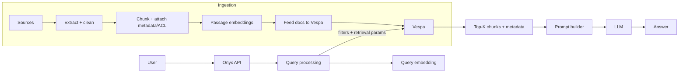

## Onyx (formerly Danswer) + Vespa: How retrieval works, what algorithms are used, and what to change to improve performance

This is a Vespa-focused breakdown of how **Onyx** uses Vespa as the retrieval engine in a RAG system, and what you should tune (exact knobs) when quality/latency is bad.

It is written for someone deploying Onyx-like architecture in a **private cloud**.

---

## 1) What Onyx uses Vespa for (high-level)

In an Onyx-style RAG system, Vespa is the “retrieval brain”:

- **Stores**: chunks + metadata + embeddings
- **Filters fast**: tenant / source / doc type / language / ACL
- **Retrieves**: vector ANN (HNSW) + keyword (BM25) and combines them (hybrid)
- **Ranks**: multi-phase ranking (cheap first pass, expensive rerank)
- **Returns**: top chunks + fields for the prompt builder

---

## 2) Concrete evidence from Onyx’s deployment config (what they actually ship)

Onyx’s Helm chart declares Vespa as a dependency and configures resources/storage for it.

- **Onyx Helm chart** (shows Vespa dependency + versions):  
  `https://github.com/onyx-dot-app/onyx/blob/main/deployment/helm/charts/onyx/Chart.yaml`
- **Onyx values.yaml** (shows Vespa PVC + CPU/memory recommendations + many retrieval knobs):  
  `https://github.com/onyx-dot-app/onyx/blob/main/deployment/helm/charts/onyx/values.yaml`

From `values.yaml`, you can see Onyx exposes knobs like:

- `HYBRID_ALPHA` (hybrid weighting)
- `DOC_TIME_DECAY` (recency / last-touched decay)
- `DISABLE_RERANK_FOR_STREAMING` (toggle reranking in certain modes)
- `LOG_VESPA_TIMING_INFORMATION` (debugging performance)
- `VESPA_SEARCHER_THREADS` (Vespa query concurrency tuning)

These are exactly the kinds of “production knobs” teams tune when retrieval gets slow or low-quality.

---

## 3) The retrieval methods / algorithms used (Vespa side)

### 3.1 Vector retrieval: ANN with HNSW

Most Onyx-like Vespa deployments do vector retrieval using:

- **HNSW** (approximate nearest neighbor) over a tensor field stored as an **attribute**
- Query operator: **`nearestNeighbor(field, query_vector)`**

Key tuning knobs:

- Query-time:
  - **`targetHits`**: how many candidates ANN should aim to produce (recall vs latency)
  - **`hnsw.exploreAdditionalHits`**: how much extra graph exploration to do (quality vs latency)
- Schema-time:
  - **`max-links-per-node`** (M): graph connectivity (quality/memory/indexing cost)
  - **`neighbors-to-explore-at-insert`** (ef_construction): build quality vs feed speed

Refs:
- `https://docs.vespa.ai/en/querying/approximate-nn-hnsw.html`
- `https://docs.vespa.ai/en/reference/querying/yql.html#nearestneighbor`

### 3.2 Keyword retrieval: BM25 over inverted index

Vespa supports classic lexical retrieval (BM25). This matters for enterprise search because:

- internal jargon / product codenames may not be well represented in embeddings

Onyx/Danswer explicitly call out why they needed hybrid search (vector-only wasn’t enough):  
`https://blog.vespa.ai/why-danswer-users-vespa/`

### 3.3 Hybrid retrieval: combine vector + keyword in one query

In Vespa, hybrid search usually means:

- match candidates from ANN + BM25
- combine scores in ranking (often with normalization)

Onyx exposes a high-level knob (e.g. `HYBRID_ALPHA`) to control the “blend” between the two.

### 3.4 Reranking (multi-phase ranking)

The standard pattern is:

- **first-phase**: cheap score (vector closeness + bm25 + simple boosts)
- **second-phase or global-phase**: expensive rerank on a small bounded set (`rerank-count`)

Ref:
- `https://docs.vespa.ai/en/ranking/phased-ranking.html`

### 3.5 Filters (metadata + ACL) evaluated fast via attributes

Production RAG requires strict filtering:

- tenant isolation (no leakage)
- source selection (Confluence vs Slack, etc.)
- doc type (runbook/policy/ticket)
- language
- permissions (allowed groups/users)

In Vespa: **store filter fields as `attribute`** so filters are cheap.

---

## 4) Onyx-style RAG pipeline (where Vespa intervenes)

> Note: Mermaid diagrams render on GitHub, but some local previews don’t support Mermaid.  
> If you don’t see the diagram, use the ASCII fallback.



**ASCII fallback:**

```text
User -> Onyx API -> Query processing -> Query embedding
                     | (filters + retrieval params)
                     v
                  Vespa -> Top-K chunks+metadata -> Prompt builder -> LLM -> Answer

Ingestion:
Sources -> Extract/clean -> Chunk+metadata/ACL -> Embed passages -> Feed -> Vespa
```

---

## 5) Performance: what to change exactly (common playbook)

Think of performance in 3 buckets: **query-time knobs**, **schema/index knobs**, **infra knobs**.

### 5.1 Query-time knobs (fastest to try)

#### A) ANN candidate depth

- **Increase recall (at cost of latency)**:
  - Increase **`targetHits`**
  - Then increase **`hnsw.exploreAdditionalHits`**
- **Decrease latency (at cost of recall)**:
  - Lower `targetHits`
  - Lower `hnsw.exploreAdditionalHits`

#### B) Reranking cost

- If latency is dominated by reranking:
  - reduce rerank depth (Vespa rank-profile `rerank-count`)
  - or disable reranking in some modes (Onyx exposes knobs like `DISABLE_RERANK_FOR_STREAMING`)

#### C) Hybrid blend

- If internal terms are missed:
  - increase keyword influence (raise keyword weight / adjust `HYBRID_ALPHA` toward BM25)
- If results are lexically correct but semantically wrong:
  - increase vector influence (adjust `HYBRID_ALPHA` toward vector)

#### D) Filters (debug before tuning)

Always run “debug mode”:

- query **with** filters
- same query **without** filters

If without filters works but with filters fails → fix ingestion metadata/ACL before touching ANN knobs.

### 5.2 Schema / index knobs (higher impact, but needs redeploy/restart)

#### A) HNSW build parameters

- `max-links-per-node` ↑ → better recall, more memory/index build cost
- `neighbors-to-explore-at-insert` ↑ → better recall, slower feeding

#### B) Distance metric + normalization

- cosine-like similarity in Vespa is typically done via **angular distance**, often with normalized vectors
- ensure your schema + embedding model match (dimension, normalization assumptions)

### 5.3 Infra knobs (often biggest real-world lever)

Onyx’s chart already hints at this: Vespa needs serious CPU/memory for indexing at scale.

Typical changes:

- give **more RAM** to content nodes (vectors + attributes + HNSW are memory hungry)
- use **fast disks** for state (SSD/NVMe PVs)
- isolate Vespa content nodes on dedicated machines (avoid noisy neighbors)
- scale content nodes (more shards / replicas) when QPS grows

---

## 6) Simple “knob map” (what symptom → what to change)

```text
Symptom: empty results for some users/tenants
  -> check filters/ACL metadata first (attribute fields + correct values)

Symptom: correct doc exists but never shows up (bad recall)
  -> raise targetHits
  -> raise hnsw.exploreAdditionalHits
  -> consider better embeddings / chunking

Symptom: doc shows up but ranking is wrong
  -> add reranking (or increase rerank depth)
  -> adjust HYBRID_ALPHA (hybrid weighting)
  -> add time decay / boosts (DOC_TIME_DECAY / ranking expression)

Symptom: latency too high
  -> lower targetHits / exploreAdditionalHits
  -> reduce rerank-count or disable rerank in streaming
  -> add RAM/CPU or scale content nodes
```

---

## 7) References (primary, high-signal)

- Onyx: Helm chart / values (Vespa dependency + tuning knobs)  
  `https://github.com/onyx-dot-app/onyx/tree/main/deployment/helm/charts/onyx`
- Danswer/Onyx reasoning for Vespa (hybrid + decay + multi-vector)  
  `https://blog.vespa.ai/why-danswer-users-vespa/`
- Vespa docs: nearest neighbor + HNSW  
  `https://docs.vespa.ai/en/querying/approximate-nn-hnsw.html`  
  `https://docs.vespa.ai/en/reference/querying/yql.html#nearestneighbor`
- Vespa docs: phased ranking  
  `https://docs.vespa.ai/en/ranking/phased-ranking.html`


