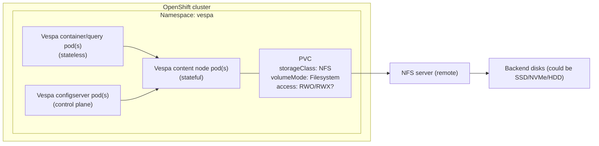

## OpenShift + Vespa storage: NFS PVC setup diagram + what to improve

This note documents a common current setup:

- OpenShift cluster
- Vespa deployed in a namespace
- Vespa content nodes use a **PVC** whose **StorageClass = NFS**
- **volumeMode = Filesystem**

Then it gives practical guidance on whether this is optimal and what can be changed.

---

## 1) Diagram: current setup (OpenShift + Vespa + NFS PVC)

> Note: Mermaid diagrams render on GitHub, but some local previews don’t support Mermaid.  
> If you don’t see the diagram, use the ASCII fallback.



**ASCII fallback (always renders):**

```text
OpenShift cluster
  └─ namespace: vespa
      ├─ Vespa content node pod(s) (stateful)
      │    └─ mounts PVC (storageClass=NFS, volumeMode=Filesystem)
      ├─ Vespa container/query pod(s) (stateless) -> content nodes
      └─ configserver pod(s) -> content nodes

PVC -> NFS server (remote) -> backend disks
```

---

## 2) Is this optimal for Vespa as a vector database?

**Usually: no (not optimal) for latency-sensitive vector search.**

Reason:

- NFS is a **network filesystem**. Even if the NFS server is backed by NVMe, the client still pays:
  - extra **network hop**
  - **jitter** (latency variation due to congestion/queueing)
  - shared server contention (many clients share the same NFS server resources)

What you’ll typically see:

- higher **p95/p99** query latency (tail latency)
- slower ingestion at higher feed rates (compaction/merge can amplify this)

When NFS can be “good enough”:

- small datasets
- low QPS
- relaxed latency requirements
- mostly in-memory working set

---

## 3) What can be changed / best options

### Option A (common best in Kubernetes): **Fast block storage for content nodes**

Use a StorageClass backed by **low-latency block storage** (not shared file storage), for example:

- ODF / Ceph RBD (block)
- SAN / iSCSI LUNs

Even if your PV is mounted as a filesystem inside the pod, the **backend being block** is what usually improves random IO latency and tail behavior.

**Why it’s good:**

- lower latency than NFS
- better random IOPS
- less “shared file server” contention pattern

### Option B (best latency): **Local NVMe via Local PV**

Schedule Vespa content pods onto nodes that have NVMe, and use local PVs.

**Pros:**

- best latency and most predictable p95/p99

**Cons:**

- operational complexity (node pinning, capacity planning, node failures)

Vespa can tolerate node failures with replication, but you must size replicas and capacity accordingly.

### Option C (keep NFS, accept limits)

If you must keep NFS:

- isolate/dedicate the NFS server for Vespa
- ensure it’s backed by SSD/NVMe and has sufficient network bandwidth
- monitor IO latency and Vespa p95/p99 closely

This can improve things, but NFS still tends to be a ceiling for high-QPS vector workloads.

---

## 4) Quick checklist (to choose the right option)

Answer these, and you can pick A vs B quickly:

- **PVC access mode**: is it `RWO` or `RWX`?
  - content-node data is typically better as `RWO` (per-pod volume), not a shared `RWX` filesystem
- **Scale**:
  - number of content pods
  - number of chunks/vectors
  - embedding dimension
- **SLO**:
  - target QPS
  - target p95 latency
- **Infra availability**:
  - do you have ODF/Ceph RBD or other block storage classes?
  - do worker nodes have local NVMe?


