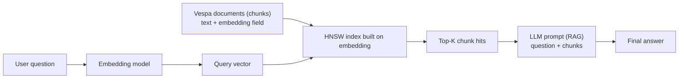
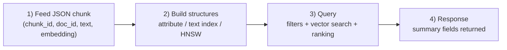

### Relational DB (MySQL/Postgres) vs Vector Store (Vespa) — beginner explanation

If you’re comfortable with MySQL/Postgres, the easiest way to understand a vector store is:

- A vector store is still a **database of records**…
- but the main “query” is: **“find the most similar records to this embedding vector”**

This document explains:

1. what changes between SQL databases and vector stores  
2. what a **chunk** is in RAG  
3. how your Vespa `chunk.sd` schema works (in simple terms)

---

## 1) Mental model: mapping SQL terms to Vespa terms

| SQL (MySQL/Postgres) | Vespa | Notes |
|---|---|---|
| Database | Vespa application | Your deployed schema + settings |
| Table | Document type / schema | Here it’s `chunk` |
| Row | Document | One “chunk” record |
| Column | Field | `chunk_id`, `doc_id`, `text`, `embedding` |
| Index (B-tree, GIN) | Index / attribute / ANN index | Different indexes for different query types |
| SELECT query | Search query (YQL) | Returns “hits” (results) |
| WHERE filters | Filters on attributes | Fast if field is an attribute |
| ORDER BY | Ranking profile | Ranking = scoring + sorting |

---

## 2) What changes in how you “query” data

### SQL mindset (exact matching + joins)
In Postgres you often do:

- exact filters: `WHERE doc_id='doc-1'`
- joins: `JOIN documents ON ...`
- sorting: `ORDER BY created_at DESC`

That’s great for:
- structured data
- exact lookups
- analytics

### Vector store mindset (semantic similarity)
In a vector store, your “main query” is:

- “Given a query vector \(q\), find the **top K nearest vectors** in the database.”

This is what powers semantic search and RAG retrieval.

You still do filters (like SQL), but the ranking is primarily **vector similarity** (sometimes combined with keyword ranking).

---

## 3) What is a “chunk” in RAG?

In RAG, you don’t usually store one full PDF as one record.
You split documents into smaller pieces called **chunks**.

- **doc_id**: which original document it came from
- **chunk_id**: which piece inside that document
- **text**: the chunk text
- **embedding**: the chunk meaning as a vector (numbers)

Why chunk?
- Because a question usually needs **one paragraph / one section**, not the entire document.
- Retrieval returns the best chunks, and the LLM uses them as context.

---

## 4) The big difference: indexes and ranking

### SQL indexes
SQL indexes help with:
- `WHERE` clauses
- sorting
- range scans

### Vector indexes (ANN)
Vector search needs a special index because comparing a query vector to **millions** of stored vectors is expensive.

Most vector DBs use **ANN** (Approximate Nearest Neighbor) indexes like **HNSW**:
- fast
- “close enough” (approximate)

Vespa supports this pattern.

---

## 5) End-to-end flow: user question → embedding → vector search → top chunks

This is the exact process you asked about, step-by-step, in simple terms.

### Step 1: User asks a question (plain text)
Example:

- User: “How do I fix Docker daemon not running?”

At this moment, it’s just text — Vespa can’t do vector similarity yet.

### Step 2: The embedding model converts the text into numbers
An **embedding model** is a model that takes text and outputs a vector:

- input: text
- output: something like `[0.012, -0.33, ...]`

Important:
- the output vector has a **fixed length** (example: 384 or 768 or 1536)
- this length must match your schema definition: `tensor<float>(x[DIM])`

### Step 3: Vespa already has embeddings stored for every chunk
When you ingested your documents earlier, you stored:

- `text` (the chunk content)
- `embedding` (the chunk meaning as a vector)

So Vespa has “a table of chunks”, and each row has a vector in the `embedding` field.

### Step 4: Vespa compares the query vector to stored vectors
Now you provide the query vector to Vespa (in the query request).

Vespa conceptually does:

- compare query vector \(q\) with each chunk’s vector \(v\)
- compute “how close” they are (cosine/angle here)
- return the top K closest chunks

But doing this exactly over many chunks is expensive, so…

### Step 5: Vespa uses an ANN index (HNSW) to do it fast
Because comparing against *every* vector is slow, Vespa can build an **HNSW** index.

- **HNSW** is like a “fast map” to jump to likely neighbors instead of scanning everything.
- It’s **approximate** (very fast, usually good enough for retrieval).

This is why your schema has:

- `distance-metric: angular`
- `hnsw { ... }`

### Step 6: Vespa returns “hits” (the best chunks)
Vespa returns the top results (hits):

- chunk id / doc id
- text
- a relevance score (how close / how relevant)

Then your application takes those returned chunks and puts them into the LLM prompt.

### Step 7: The LLM answers using the retrieved chunks (RAG)
Finally:
- LLM sees: user question + retrieved chunk texts
- LLM generates an answer grounded in those chunks

#### The whole pipeline in one diagram



---

## 5) Explaining your `chunk.sd` schema (line-by-line, easy)

This is your file:

```1:40:my-vespa-app/schemas/chunk.sd
schema chunk {

  document chunk {
    field chunk_id type string {
      indexing: summary | attribute
    }
    field doc_id type string {
      indexing: summary | attribute
    }
    field text type string {
      indexing: summary | index
      index: enable-bm25
    }

    # Keep this small by default so examples are readable.
    # Change 128 to your real embedding dimension (e.g., 384/768/1536).
    field embedding type tensor<float>(x[128]) {
      indexing: attribute
      attribute {
        distance-metric: angular
        hnsw {
          max-links-per-node: 16
          neighbors-to-explore-at-insert: 200
        }
      }
    }
  }

  rank-profile vector {
    first-phase {
      expression: closeness(embedding)
    }
  }

  rank-profile hybrid inherits vector {
    first-phase {
      expression: 0.5 * bm25(text) + 0.5 * closeness(embedding)
    }
  }
}
```

### 5.1 `schema chunk` and `document chunk`
Think: **table name = chunk**, and each stored record is one **chunk** document.

### 5.2 `chunk_id` and `doc_id`
These are metadata fields, like columns in SQL.

`indexing: summary | attribute` means:

- **summary**: return this field in the search response (like selecting columns to show).
- **attribute**: store it so Vespa can filter fast (like indexing a column for WHERE).

### 5.2.1 When do these “intervene” exactly? (timeline)

Think of Vespa as doing 4 phases:

1) **Feed (ingestion time)**: you send JSON documents (your chunks) to Vespa  
2) **Indexing time**: Vespa builds the internal data structures (attributes, text index, HNSW)  
3) **Query time**: you send a query; Vespa uses those structures to find and rank hits  
4) **Response time**: Vespa returns only the fields included in the “summary”

Here is the big picture:



Now map schema keywords to phases:

- **`attribute`** intervenes at:
  - **Indexing time**: Vespa stores a fast lookup structure for the field
  - **Query time**: fast **filters**, fast access for ranking/grouping/sorting
- **`index`** intervenes at:
  - **Indexing time**: Vespa builds a **text inverted index**
  - **Query time**: keyword search + BM25 scoring can work
- **`summary`** intervenes at:
  - **Response time**: the field can be returned in hits without extra fetch cost

If you remember one sentence:

> **attribute = fast filtering**, **index = keyword search**, **summary = returned in results**.

### 5.2.2 What are these fields, in human terms?

#### `doc_id` (document-level id)
This is the id of the **original document** (PDF / page / ticket / wiki page) the chunk came from.

- Used for:
  - grouping results (“show at most 1 chunk per doc”)
  - debugging (“which document did this chunk come from?”)
  - filtering (“only search in doc_id=…” when debugging)

#### `chunk_id` (chunk-level id)
This identifies the **piece** inside the document.

Common patterns:
- `chunk_id = "<doc_id>#<chunk_index>"`
- or a UUID

Used for:
- uniquely addressing a chunk record
- debugging duplicates / missing chunks

### 5.2.3 Concrete example: what you actually feed (ingestion)

At ingestion time you send something like:

```json
{
  "fields": {
    "chunk_id": "doc-42#0007",
    "doc_id": "doc-42",
    "text": "If Docker exits with code 137, it usually means the container was killed (OOM)...",
    "embedding": [0.01, -0.02, 0.04 /* ... length must match x[128] ... */]
  }
}
```

Then Vespa builds:
- an **attribute store** for `chunk_id` and `doc_id` (fast filters)
- a **text index** for `text` (BM25)
- an **HNSW index** for `embedding` (fast ANN)

### 5.3 `text` (keyword search column)
`indexing: summary | index` means:

- **index**: build a text index so you can do keyword search
- **summary**: return text in results

`enable-bm25` means: “allow BM25 keyword ranking on this text”.

### 5.3.1 When does `text` intervene?

- **Query time**:
  - if you do **keyword search**, Vespa uses the `index` structure
  - if you use the `hybrid` rank profile, `bm25(text)` uses the text index
- **Response time**:
  - because of `summary`, the `text` field can be returned in the hit (so your RAG app can put it into the prompt)

### 5.4 `embedding` (vector column)
`tensor<float>(x[128])` is a vector of length 128.

This is like a column that stores an array of floats, but used for similarity search.

- **dimension**: 128 here (must match your embedding model output)
- **distance-metric: angular**: similar to cosine distance

`hnsw { ... }` means: “build an ANN index” so vector search is fast.

### 5.4.1 When does `embedding` intervene?

- **Ingestion time** (outside Vespa):
  - your embedding model converts chunk text → vector
- **Indexing time** (inside Vespa):
  - Vespa stores the vector as an `attribute` and builds an HNSW index
- **Query time**:
  - your app sends a **query vector**
  - Vespa uses the HNSW index to find nearest neighbors
  - the rank profile uses `closeness(embedding)` to score hits

### 5.5 Ranking profiles (ORDER BY for search)

#### `rank-profile vector`
This is “vector-only ranking”:
- score = `closeness(embedding)`
- higher score = more similar

#### `rank-profile hybrid`
This is “keyword + vector ranking”:

\[
score = 0.5 \cdot bm25(text) + 0.5 \cdot closeness(embedding)
\]

It’s similar to:
- “ORDER BY combined_score DESC”

### 5.6 A very simple “who uses what, when?” table

| Schema thing | What it is | Used when? | Why it exists |
|---|---|---|---|
| `field doc_id type string` | metadata column | query (filters/grouping), response (debug) | link chunk → original doc |
| `field chunk_id type string` | metadata column | query (filters), response (debug) | unique id for the chunk record |
| `field text type string` + `index` | text index | query | keyword search + BM25 |
| `field embedding type tensor...` + HNSW | vector index | query | semantic similarity search |
| `summary` | returnable field | response | include field in returned hits |
| `attribute` | fast stored field | query | fast filters/sorting/grouping and ANN storage |

---

## 6) How a query looks (SQL vs Vespa)

### SQL example
“Give me rows where doc_id is doc-1 and text contains ‘docker’, ordered by relevance”

### Vespa idea (high level)
“Retrieve nearest vectors (semantic) + optionally combine with BM25 (keyword)”

Vespa returns **hits** (top results).  
`hits=10` means “return 10 documents”.

---

## 7) Practical advice (what to remember)

- SQL DBs are great at **exact matching and joins**.
- Vector stores are great at **similarity search** (“meaning” matching).
- RAG needs both:
  - metadata filters (like SQL WHERE)
  - vector similarity (semantic)
  - sometimes BM25 (keyword)
- Chunking quality strongly affects retrieval quality.


