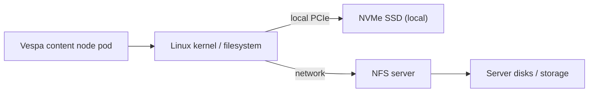

## Storage for Vespa / Vector DB: NFS vs NVMe SSD (junior-friendly deep dive)

If you run Vespa as a vector DB, **storage latency** shows up directly as:

- slower indexing/feeding
- slower queries (especially **p95/p99** tail latency)
- higher CPU wasted waiting on IO

This document explains **why NFS feels slow** for vector DB workloads and why **local NVMe SSD** is usually the best option.

---

## 0) One-sentence recommendation

- **Best for Vespa content nodes**: **local NVMe SSD / fast block storage**  
- **Avoid for Vespa content nodes**: **NFS-backed PVCs** (OK for logs/backups; risky for latency-sensitive data)

---

## 1) What Vespa is storing (what touches disk)

Vespa has different node roles, but the one that matters for storage performance is the **content node**:

- stores indexed data (text indexes, attribute data, tensor attributes for embeddings)
- runs matching + ranking close to the data (shared-nothing architecture)

Ref (Vespa architecture / compute where data lives):  
`https://vespa.ai/architecture/`

### Typical IO patterns for vector DB workloads

- **Many small random reads**:
  - ANN graph traversal (HNSW) touches many nodes/pointers
  - attribute lookups and document summary fetch
- **Write-heavy bursts**:
  - feeding, re-feeding, compaction/merge
- **Tail latency sensitivity**:
  - a single slow IO can “drag” the whole query to p95/p99

---

## 2) Mental model: why NFS is different from NVMe

### NFS (Network File System)

NFS is “a filesystem over the network”:

- your Vespa pod asks the kernel to read a block
- the kernel sends network requests to an NFS server
- server reads its disks, sends data back over network

That adds:

- network latency + jitter
- shared server contention (many clients hit the same server)
- protocol overhead (metadata ops, locking semantics, caching behavior)

### NVMe SSD (local)

NVMe is a local device directly attached via PCIe:

- no network hop
- extremely low latency
- huge IOPS
- very predictable tails

---

## 3) Diagram: data path difference (NFS vs NVMe)

> Note: Mermaid renders on GitHub. If you don’t see it, use ASCII fallback.



**ASCII fallback:**

```text
NVMe path:
Vespa pod -> kernel/filesystem -> NVMe SSD (local)

NFS path:
Vespa pod -> kernel/filesystem -> network -> NFS server -> server disks -> network -> back
```

---

## 4) Performance differences (what actually changes)

### 4.1 Latency (the biggest pain point)

- **NVMe**: very low latency per IO; fewer surprises
- **NFS**: adds network latency and jitter; tail latency increases

For vector search, **tail latency matters more than average latency**.

### 4.2 IOPS (random IO capacity)

Vector DB workloads are often random-IO heavy.

- **NVMe**: very high random IOPS (great for small reads)
- **NFS**: limited by network + server + shared contention; random IOPS often much lower

### 4.3 Throughput (MB/s)

Throughput helps for large sequential reads/writes, but vector DB pain is usually **random IO** + **tail latency**, not max MB/s.

### 4.4 Contention / noisy neighbors

With NFS, multiple pods/nodes share the same:

- NFS server CPU
- server network
- server disks

So if another workload spikes, your Vespa queries slow down.

### 4.5 Failure domain & blast radius

- **NVMe local**: a node failure affects only that node (Vespa replication handles it if sized correctly)
- **NFS**: NFS server issues can affect the entire cluster at once (big blast radius)

### 4.6 Consistency / locking pitfalls

Some databases explicitly warn about NFS due to filesystem semantics and locking issues (risk depends on implementation and setup).

Example warning (Neo4j):  
`https://neo4j.com/developer/kb/can-i-use-nfs-as-my-filesystem-or-datastore-storage/`

---

## 5) Why this matters *specifically* for Vespa + vector search

### 5.1 HNSW is latency-sensitive

HNSW is an approximate nearest neighbor algorithm that does graph traversal. If parts of your data are not in RAM (or you use disk-backed/paged storage), storage latency affects:

- how long it takes to traverse the graph
- how quickly Vespa can evaluate candidates

Vespa docs (HNSW and tuning):  
`https://docs.vespa.ai/en/querying/approximate-nn-hnsw.html`

### 5.2 Vespa runs compute where the data is

This is a feature: avoid sending lots of data over the network during queries.  
But it also means content nodes need **fast local IO** to keep latency stable.

Ref: `https://vespa.ai/architecture/`

---

## 6) What “best storage” usually means in Kubernetes

### Best (common production choice)

- **Local NVMe** exposed as:
  - Kubernetes **local persistent volumes**, or
  - a storage class that gives **node-local SSD**, or
  - fast block devices (SAN / Ceph RBD / iSCSI), if they meet latency requirements

Kubernetes docs (local volumes):  
`https://kubernetes.io/docs/concepts/storage/volumes/#local`

### OK alternatives (if you can’t do local NVMe)

- high-performance block storage with low latency and good random IOPS
- still avoid shared file storage for the main Vespa data path when possible

### NFS: when it’s acceptable

NFS can be acceptable for:

- backups
- logs
- artifacts
- non-latency-sensitive components

But for **content node data**, NFS is usually where you hit the first serious performance ceiling.

---

## 7) Simple table: NFS vs NVMe for Vespa content nodes

| Category | NFS PVC | NVMe SSD (local) |
|---|---:|---:|
| IO latency | higher + jitter | very low + stable |
| p95/p99 query latency | often worse | usually best |
| Random IOPS | limited by network/server | very high |
| Contention | shared server bottleneck | isolated per node |
| Blast radius | NFS server affects many | per-node failures |
| Operational simplicity | central storage, easy resize | needs node planning |
| Best use | backups/logs | primary Vespa data |

---

## 8) “What should we change exactly?” (action plan)

### Step 1: Confirm storage is the bottleneck

Measure:

- Vespa query p95/p99
- node disk IO latency (and NFS latency)
- feed throughput during ingestion

### Step 2: Move **content node PVCs** off NFS

Target:

- local NVMe (preferred) or fast block storage

### Step 3: Keep NFS for non-critical data

Use NFS for:

- backups, logs, exports, artifacts

### Step 4: Validate with a before/after benchmark

Run the same workload:

- same dataset size
- same `targetHits` / `hnsw.exploreAdditionalHits`
- compare p95/p99 latency and CPU utilization

---

## 9) References (good starting points)

- Vespa architecture: `https://vespa.ai/architecture/`
- Vespa HNSW: `https://docs.vespa.ai/en/querying/approximate-nn-hnsw.html`
- NFS vs local storage benchmark example (MySQL): `https://errantminds.net/servers-it/mysql-benchmarks-nfs-vs-local-storage/`
- NFS risk example (Neo4j): `https://neo4j.com/developer/kb/can-i-use-nfs-as-my-filesystem-or-datastore-storage/`
- Kubernetes local volumes: `https://kubernetes.io/docs/concepts/storage/volumes/#local`


