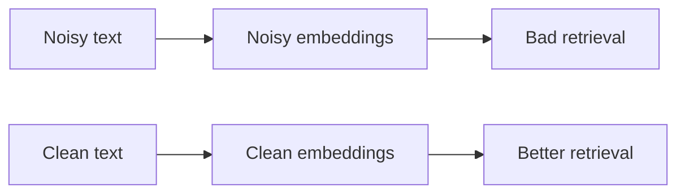

### Different Chunking for Different Data (deep but easy)

There is no “one chunking strategy” that works perfectly for every document type.

Different data has different structure:

- PDFs: pages + paragraphs, sometimes bad OCR
- Web pages: headings + sections + navigation noise
- Code: functions/classes + comments
- Tables: rows/columns, not sentences
- Tickets/logs: timestamps, short lines, repeated patterns

---

### 1) A simple decision table (beginner-friendly)

| Data type | Best chunk boundary | Notes |
|---|---|---|
| Markdown / wiki | headings + paragraphs | include header breadcrumbs |
| PDFs (clean text) | headings + paragraphs + page | keep page metadata |
| PDFs (OCR/noisy) | paragraphs + cleanup | remove headers/footers, fix line breaks |
| HTML docs | main article section | strip nav, cookie banners, menus |
| Source code | function/class blocks | store file path + symbol name |
| Tables/CSV | row groups | keep header row as context |
| Logs | time window / event block | group by request id / trace id if possible |
| Chat/transcripts | speaker turns + time windows | moderate overlap can help |

---

### 2) Examples (what chunk looks like)

#### Example A: Developer docs (Markdown)

Chunk metadata:

- `title`: “rag_app README”
- `breadcrumb`: “Troubleshooting > Vespa”
- `text`: “Deploy failed because distribution-key missing...”

Why it works:
- one chunk = one fix
- breadcrumb improves retrieval

#### Example B: Code

Chunk metadata:

- `file_path`: `rag_app/docker-compose.yml`
- `symbol`: `services.vespa`
- `text`: the service block

Why it works:
- questions like “what port does Vespa use?” match well
- avoids mixing unrelated code

#### Example C: Table data

For a table, chunk by row groups and keep header row:

```text
Header: Name | Port | Purpose
Rows:
  OpenWebUI | 3000 | UI
  Ollama    | 11434| LLM
  Vespa     | 8080 | Search API
```

Why it works:
- without header row, the numbers are meaningless

---

### 3) The most important cleanup step (web + PDF)

Many “bad retrieval” issues are actually “bad text”.

Common noise:

- repeated headers/footers in PDFs
- navigation menus in HTML
- cookie banners
- page numbers repeated on every page

If you embed noisy text, your embeddings become noisy too.



---

### 4) A practical workflow (how to choose chunking)

1. Pick 20–50 real user questions.
2. Run retrieval and inspect top-5 chunks.
3. Label common failures:
   - “split answer” → boundary/overlap issue
   - “wrong section” → structure-aware issue
   - “noise returned” → cleaning issue
   - “duplicates” → overlap too large / MMR needed
4. Adjust chunking strategy **per document type**.

This is how teams get from “RAG is bad” to “RAG is useful”.


