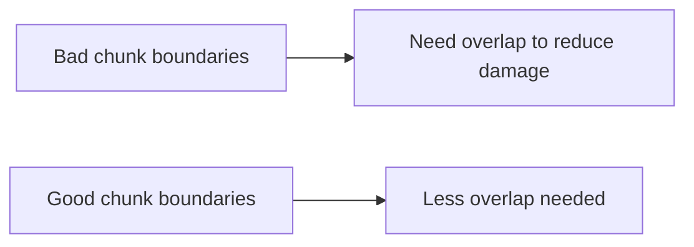

### Overlap to Preserve Context (deep but easy)

**Overlap** means: when you create chunk #2, you repeat a little bit of chunk #1 at the start (or end).

Example:

- Chunk 1: tokens 0–300
- Chunk 2: tokens 250–550

Overlap size = 50 tokens.

---

### 1) Why overlap helps

Overlap helps when a useful idea spans a boundary.

Without overlap, you can split a sentence or explanation:

```text
Chunk 1: "To fix exit 137, increase Docker memory because the container..."
Chunk 2: "...was killed by the kernel when it exceeded the memory limit."
```

If the retriever only returns Chunk 1, the “why” is missing.
If it returns only Chunk 2, the “what to do” is missing.

Overlap reduces this risk.

---

### 2) Why overlap can hurt (important!)

Overlap increases:

- **duplicate chunks** (many chunks share the same content)
- **index size** (more tokens stored)
- **retrieval duplicates** (top results look the same)
- **embedding cost** (more text to embed)

So overlap is a tool, not a default rule.

---

### 3) How much overlap should you use?

There is no perfect number, but here’s a beginner-friendly guide:

- **0 overlap**:
  - best for short, well-structured docs
  - best when chunk boundaries are “natural” (paragraphs/sections)

- **10–15% overlap** (common):
  - good starting point for transcript-like text
  - example: 300-token chunks, 30–50 token overlap

- **Large overlap** (risky):
  - usually only needed if your chunker is poor and cuts mid-thought

---

### 4) Overlap vs structure-aware chunking

If you do structure-aware chunking well, you often need *less* overlap.



Best practice:

- Fix boundaries first (paragraph/heading chunking)
- Add overlap only if evaluation shows “boundary loss” problems

---

### 5) Overlap is different for different data

- **Troubleshooting docs**: low overlap (sections are complete)
- **Transcripts**: moderate overlap (ideas span sentences)
- **Code**: overlap is usually unnecessary if you keep functions/classes intact

---

### 6) A simple check for “overlap needed”

Ask: “Do my top results look like partial answers?”

- If yes: add overlap or fix boundaries.
- If top results are complete but wrong: overlap won’t help; try better chunking or better retrieval.


