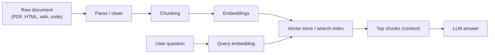

### Chunking (for junior LLM engineers)

Chunking is how you turn a big document into smaller pieces (**chunks**) so your retriever can find the right parts.

In RAG, chunking is often the #1 reason retrieval quality is “bad” or “good”.

---

### Quick map (what happens)

---

### What you’ll learn in this folder

- **Stop Fixed-Size Chunking**: `Stop-Fixed-Size-Chunking.md`
- **Structure-Aware Chunking**: `Structure-Aware-Chunking.md`
- **Overlap to Preserve Context**: `Overlap-to-Preserve-Context.md`
- **Different Chunking for Different Data**: `Different-Chunking-for-Different-Data.md`

---

### Simple rules of thumb (good starting point)

- **Start with structure-aware chunking** when you can (headers, paragraphs, code blocks).
- **Use overlap only when needed** (it helps continuity but increases duplicates and cost).
- **Always keep metadata** per chunk: `doc_id`, `section`, `page`, `title`, `source`, `created_at`.
- **Evaluate retrieval** with real questions before tuning the LLM.

