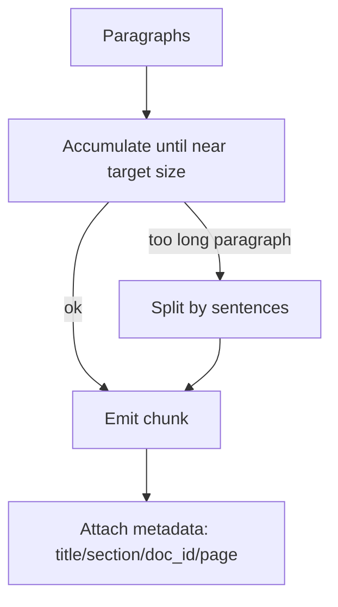

### Stop Fixed-Size Chunking (deep but easy)

**Fixed-size chunking** means: “cut text every N tokens/characters, no matter what the text structure is.”

It’s common because it’s easy to implement, but it often causes **bad retrieval**.

---

### 1) Why fixed-size chunking causes bad retrieval

#### Problem A: You split meaning in half

Example: a FAQ answer is one idea, but you cut it in the middle.

```text
Chunk 1: "To fix the Docker daemon error, start Docker Desktop and ensure..."
Chunk 2: "...the socket path is accessible. Then re-run docker compose up..."
```

Now the retriever might find only Chunk 1 or only Chunk 2, and the LLM receives incomplete context.

#### Problem B: You mix unrelated topics

If a chunk covers two sections (end of one section + start of another), the embedding becomes “confused”:

```text
Chunk: "Vespa monitoring... Grafana dashboards...  ---  Chunking strategies..."
```

This chunk matches too many queries “a little bit” and ranks higher than it should.

#### Problem C: Titles and headers get separated from their content

Headers are **strong signals**. If you separate:

- Title: “Troubleshooting: container exited (137)”
- Body: the explanation + fix

Then retrieval becomes weaker.

---

### 2) When fixed-size chunking is still okay

Fixed-size chunking can be acceptable when:

- the document has weak structure (chat logs, transcripts) AND
- you add *some* heuristics (don’t cut mid-sentence, keep paragraphs together) AND
- you evaluate retrieval and it works well enough.

But you usually still want “soft structure” rules.

---

### 3) Better alternatives (what to do instead)

#### Option 1: Sentence / paragraph boundary chunking (simple structure-aware)

Instead of cutting every N tokens:

- group whole paragraphs together until you reach a target length
- never cut a paragraph in half

#### Option 2: Header-aware chunking (best for docs)

If you have headings:

- chunk by section
- attach the heading text to each chunk

#### Option 3: Semantic chunking (advanced)

This tries to split where topics change (model-based). It can be powerful but costs more.

---

### 4) A simple “good” fixed-size upgrade (if you must keep it)

If you can’t do structure-aware yet, do **this minimum upgrade**:

1. Choose a target size (example: 250–400 tokens)
2. Build chunks by adding paragraphs until you are near the limit
3. If one paragraph is too long, split it by sentences
4. Add **metadata**: title, section header, doc_id, page



---

### 5) How you know fixed-size chunking is hurting you (symptoms)

- Retrieval returns chunks that feel “half useful, half random”.
- The right answer exists in the docs, but the LLM says “not found”.
- Top results contain **two different topics**.
- Re-ranking helps a bit but not enough.

When you see these symptoms, chunking is usually the first thing to fix.


