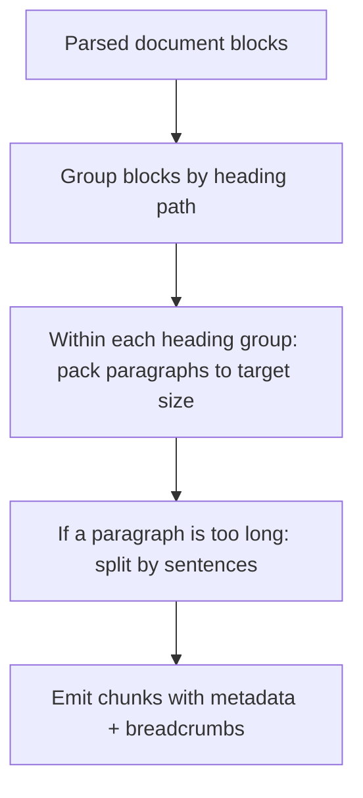

### Structure-Aware Chunking (deep but easy)

**Structure-aware chunking** means: “split documents using their natural structure instead of a fixed size.”

Natural structure examples:

- headings (`H1/H2/H3`)
- sections
- paragraphs
- bullet lists
- tables
- code blocks

---

### 1) Why structure-aware chunking helps retrieval

Retrieval works better when each chunk is about **one coherent idea**.

- Embeddings represent “meaning”.
- If a chunk contains one idea, its embedding is clear.
- If a chunk mixes ideas, the embedding becomes blurry and retrieval gets noisy.

---

### 2) How to do it in practice (3 levels)

#### Level 1 (easy): Paragraph chunking

- keep paragraphs intact
- group consecutive paragraphs until you reach your target size
- never cut mid-paragraph unless it’s extremely long

Best for: plain text, emails, internal docs.

#### Level 2 (better): Header + section chunking

- detect headings
- for each heading section:
  - include the heading text in every chunk from that section
  - chunk inside the section if it’s too long

Best for: markdown docs, wikis, manuals, README files.

#### Level 3 (advanced): Preserve special blocks

Some blocks should stay intact:

- code blocks
- tables (or treat each row group as a chunk)
- YAML/JSON configs

Best for: developer docs, API references, troubleshooting guides.

---

### 3) A concrete example (Markdown doc)

Input:

```text
## Troubleshooting
### Container exited 137
Explanation...
Fix...

### Vespa deploy failed (distribution-key)
Explanation...
Fix...
```

Structure-aware chunking output:

- Chunk A: “Troubleshooting → Container exited 137 → explanation + fix”
- Chunk B: “Troubleshooting → Vespa deploy failed → explanation + fix”

Now each chunk is a “complete answer unit”.

---

### 4) The most important trick: “header breadcrumbs”

When you chunk a section, attach a breadcrumb string:

```text
title: "rag_app README"
breadcrumb: "Troubleshooting > Vespa > deployment"
text: "...actual chunk text..."
```

Why it matters:

- The breadcrumb gives extra context to both embeddings and the LLM.
- The retriever can match “Troubleshooting” even if the chunk text doesn’t repeat the word.

---

### 5) Common pitfalls

- **Pitfall: chunks become too small**
  - a single bullet point chunk can be too short and ambiguous
  - fix: group related bullets under the same heading

- **Pitfall: one section is huge**
  - fix: chunk inside the section by paragraphs/sentences while keeping header breadcrumbs

- **Pitfall: tables get destroyed**
  - fix: treat tables specially (keep as block or chunk by row groups)

---

### 6) A simple algorithm you can implement



This is “simple enough” to implement and usually beats naive fixed-size chunking.


