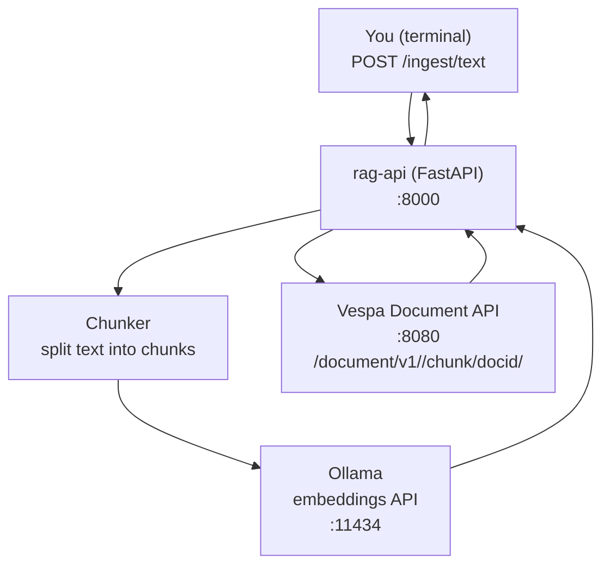

### 2026-01-08 — `rag-api` ingest endpoint returned `{"detail":"Not Found"}`

#### Summary (what happened)
While following `rag_app/README.md`, this command returned a 404 from `rag-api`:

```bash
curl -s http://localhost:8000/ingest/text \
  -H "Content-Type: application/json" \
  -d '{
    "doc_id": "doc-1",
    "text": "Paste a few paragraphs here. This will be chunked, embedded, and stored in Vespa."
  }' | python3 -m json.tool
```

Output:

```json
{ "detail": "Not Found" }
```

This means: **the HTTP route `/ingest/text` did not exist** in the running `rag-api` container.

---

#### Root cause (the real reason)
`rag_app/rag-api/app/main.py` was still a **stub**:

- It only implemented:
  - `GET /health`
  - `GET /v1/models`
  - `POST /v1/chat/completions` (stub)
- It did **not** implement:
  - `POST /ingest/text`
  - `POST /ingest/file`

So FastAPI correctly returned 404 for `/ingest/text`.

---

#### Fix (what we changed)
We implemented ingestion in `rag-api` so the README commands work:

- Added endpoints:
  - `POST /ingest/text`
  - `POST /ingest/file` (multipart upload for txt/md/pdf)
- Implemented ingestion pipeline:
  - **chunk text** (word-based chunking with overlap)
  - **embed each chunk** using **Ollama embeddings** (default model: `nomic-embed-text`)
  - **feed chunks into Vespa** using the Vespa Document API
- Added required dependencies:
  - `requests`, `python-multipart`, `pypdf`
- Rebuilt and restarted `rag-api`:
  - `docker compose up -d --build rag-api`

Files changed:
- `rag_app/rag-api/app/main.py`
- `rag_app/rag-api/requirements.txt`
- `rag_app/README.md` (added note about “model not found”)

---

#### Secondary issue encountered (common gotcha)
After adding the endpoints, ingestion could still fail with an error like:

> `model "nomic-embed-text" not found, try pulling it first`

This happens because **Ollama does not have the embedding model yet**.

Fix:

```bash
docker exec rag_ollama ollama pull nomic-embed-text
```

Then `/ingest/text` succeeds.

---

## Detailed architecture + where it failed

### 1) Intended workflow



### 2) Failure points we hit (highlighted)

```mermaid
flowchart TD
  U["You (terminal)\nPOST /ingest/text"] --> R["rag-api (FastAPI)\n:8000"]

  R -->|FAIL #1| F1["404 Not Found\nRoute /ingest/text did not exist\n(rag-api was a stub)"]

  R --> C["Chunker"]
  C --> O["Ollama :11434\nembeddings model"]
  O -->|FAIL #2| F2["Model not pulled\n\"nomic-embed-text\" not found"]

  O --> R
  R --> V["Vespa :8080\nDocument API"]
  V --> R
  R --> U
```

---

## How to verify the fix (quick)

1) Rebuild `rag-api`:

```bash
cd /Users/chihebmhamdi/Desktop/vespa/rag_app
docker compose up -d --build rag-api
```

2) Pull embedding model (first time):

```bash
docker exec rag_ollama ollama pull nomic-embed-text
```

3) Ingest:

```bash
curl -s http://localhost:8000/ingest/text \
  -H "Content-Type: application/json" \
  -d '{"doc_id":"doc-1","text":"hello"}' | python3 -m json.tool
```

4) Confirm document exists in Vespa:

```bash
curl -s http://localhost:8080/search/ \
  -H "Content-Type: application/json" \
  -d '{"yql":"select chunk_id, doc_id, text from sources chunk where doc_id contains \"doc-1\";","hits":5}' \
  | python3 -m json.tool
```


