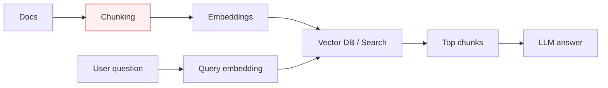

### Use case 1 — Chunking made retrieval “bad”

#### What “bad” looked like
- Users ask a question, and the answer exists in the docs, but the system responds **“not found”**.
- Top retrieved chunks look **half relevant** (missing the key sentence).
- The top-5 chunks contain **mixed topics** (end of section A + start of section B).

---

### Architecture (where the failure happens)

The failure is at **chunking**, before the database and LLM.

---

### Root causes (common in real RAG deployments)

#### Cause A: Fixed-size chunking split the “answer unit”
The “answer unit” is the smallest piece of text that fully answers a question (often a section or a short multi-paragraph block).

Fixed-size chunking breaks it into two chunks, so retrieval returns only half the fix.

#### Cause B: Headers/titles separated from their content
The chunk with the header is short and ambiguous; the chunk with the content loses the strong “topic signal”.

#### Cause C: PDFs/web pages include repeated noise
Headers/footers, menus, cookie banners get embedded into every chunk → embeddings become noisy → retrieval gets noisy.

---

### Workarounds (step-by-step)

#### Step 1: Switch to structure-aware chunking
- Use headings + paragraphs as boundaries
- Keep code blocks intact
- Keep lists intact under the same heading

#### Step 2: Add “breadcrumb metadata” to every chunk
Example:

- `title`: “Troubleshooting”
- `breadcrumb`: “Troubleshooting > Docker > exit 137”

Include the breadcrumb text when embedding, or store it as metadata and prepend at prompt time.

#### Step 3: Add overlap only if you still see “boundary loss”
- Start with 0 overlap for well-structured docs
- If you still lose context at boundaries, add ~10% overlap

#### Step 4: Clean the text before chunking
For PDFs/web pages:
- remove repeated headers/footers
- remove nav menus
- remove cookie banners
- normalize whitespace and line breaks

---

### Checklist (quick)
- **If chunks look mixed-topic** → chunk boundaries are wrong.
- **If chunks look partial** → boundaries or overlap are wrong.
- **If results are “random noise”** → source text cleaning is missing.

