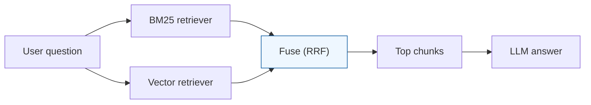

### Use case 3 — Lexical-only or vector-only retrieval failed (hybrid + fusion)

#### What “bad” looked like
- Query contains an exact string (error code, function name), but vector search misses it.
- Query is a paraphrase, but keyword search misses it.
- People keep “tuning the LLM”, but the retrieved context is the wrong text.

---

### Architecture (hybrid retrieval)

---

### Root causes

#### Cause A: Vector retrieval struggles with “exact match”
IDs like `exit 137`, stack traces, or config keys often need lexical matching.

#### Cause B: Keyword retrieval struggles with paraphrases
User asks “docker can’t talk to daemon”; docs say “Cannot connect to docker.sock”.

---

### Workarounds (step-by-step)

#### Step 1: Run both retrievers
- BM25 (keyword)
- vector (semantic)

#### Step 2: Fuse results (RRF)
RRF avoids the “score mismatch” problem (BM25 scores and vector scores aren’t comparable).

#### Step 3: Re-rank the fused candidates
After you fuse, you can re-rank top 50 → return top 8.

This usually improves precision a lot.

---

### Checklist (quick)
- **If exact strings are missing** → add BM25.
- **If paraphrases are missing** → add vectors.
- **If both are noisy** → fuse + re-rank.

