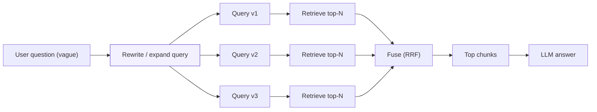

### Use case 4 — Queries were vague (query rewriting + multi-query retrieval)

#### What “bad” looked like
- User asks: “it doesn’t work” or “it crashed”
- Retriever returns generic “overview” chunks, not the fix
- LLM answers are generic and not actionable

---

### Architecture (rewriting + multi-query)

---

### Root causes

#### Cause A: User didn’t include important keywords
People don’t know what to type. They omit the error code, the component name, or the exact term used in docs.

#### Cause B: One phrasing doesn’t match the docs
Docs and users use different vocabulary.

---

### Workarounds (step-by-step)

#### Step 1: Query rewriting
Use a small LLM prompt like:

- “Rewrite this question for search. Add likely keywords, error terms, and synonyms. Keep it short.”

Example:

- User: “vespa failed”
- Rewrite: “vespa deploy failed services.xml distribution-key missing HTTP 400”

#### Step 2: Multi-query retrieval
Generate multiple query variants:

- one “keyword heavy”
- one “semantic paraphrase”
- one “short direct”

Retrieve top-N for each and fuse.

#### Step 3: Keep the original question for the final answer
Important: rewriting is for **retrieval**, not for what you show the user.

---

### Checklist (quick)
- **If retrieval is generic** → rewrite the query to include keywords.
- **If one rewrite still fails** → multi-query + fuse.

