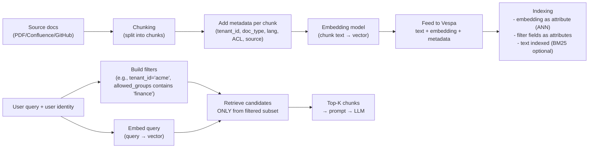
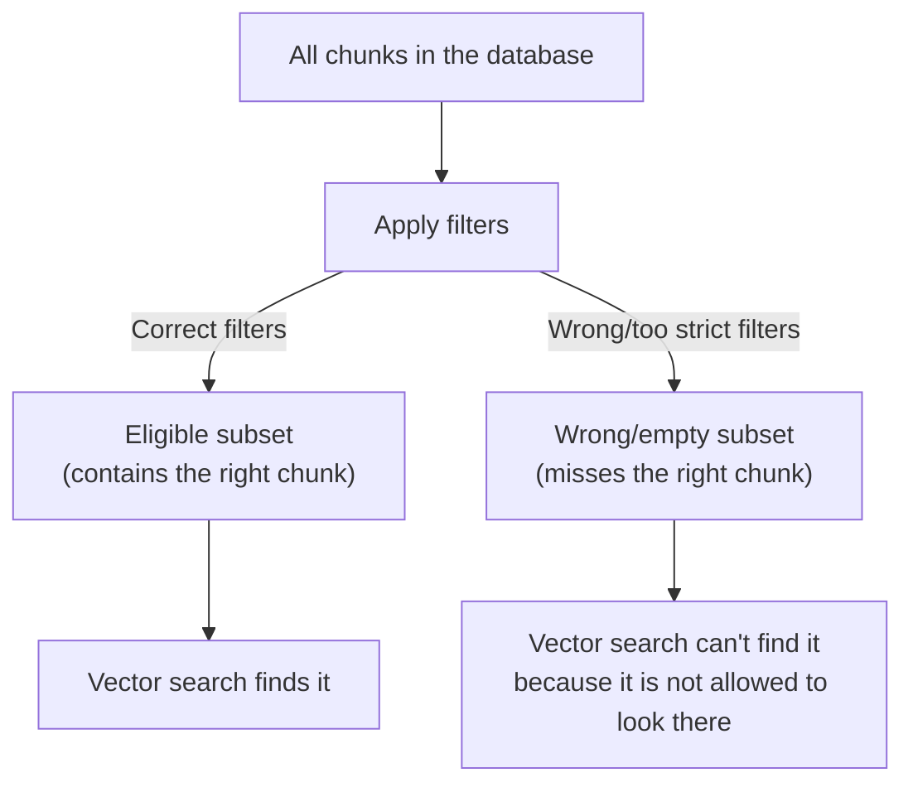
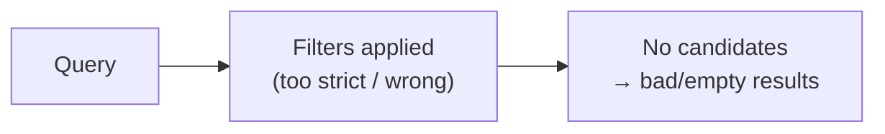

### Real-world vector DB / vector store issues (RAG) — beginner-friendly deep dive

This document is a “deep research” style guide, but explained **very simply**.
It focuses on what breaks in real projects using a vector DB (Vespa, Milvus, Pinecone, Weaviate, etc.) and what teams do to fix it.

You will see the same pattern again and again:

> **Bad answers are usually caused by bad retrieval**, not the LLM.

---

## 0) The full pipeline (where problems can happen)

If you learn one debugging habit:

- **Always locate the failure stage** (query filters? embeddings? ANN recall? ranking? chunking?).

---

## 1) Failure mode #1: “Vector DB is bad” but the real bug is **filters**

### What are “filters”? (definition, explained slowly)

A **filter** is a rule you apply at query time that says:

> “Only consider documents/chunks whose **metadata fields** match these conditions.”

In other words, filters do **subset selection**.

- **Vector similarity** answers: “Which chunks are *most similar in meaning* to my question?”
- **Filters** answer: “Which chunks are *allowed/eligible* to be searched at all?”

If your filter is wrong (or too strict), the system will search inside the **wrong subset** (or an empty subset), even if the right document exists.

**Where do filters come from?**

Almost always from **metadata you stored during ingestion**. For example, every chunk you ingest might carry fields like:
- `tenant_id` (which company/team owns the doc)
- `doc_type` (policy/runbook/ticket)
- `source` (confluence/github/slack)
- `lang` (en/fr)
- `allowed_users` / `allowed_groups` (permissions)

Then, at query time, you apply filters using those fields.

**Important Vespa detail (why `attribute` matters):**

In Vespa, fields you want to filter on are typically stored as **attributes** (fast access). In your schema you already have examples like:
- `chunk_id` and `doc_id` using `indexing: summary | attribute`

That pattern is what makes filtering efficient and predictable.

### Diagram: ingestion metadata → stored fields → filtered retrieval

### Diagram: why wrong filters feel like “vector search is broken”

### What it looks like (symptoms)
- For some users/tenants, results are empty or unrelated.
- For other tenants, it works.
- In logs you see “retrieval returned 0 hits” even though you know docs exist.

### Root cause (why it happens)
You applied a filter like:
- tenant_id = `t1`
- doc_type = `policy`
- language = `en`

…but the data was ingested with wrong metadata, or your filter value is wrong.

**Analogy**: You’re searching Google but you accidentally restrict to “site:wrong-domain.com”. The search engine is fine—your filter is not.

### Fixes teams use
- **Log filters** on every request (tenant, source, time range).
- Store filter fields as fast attributes (in Vespa: `attribute`) so filters are cheap.
- Add “debug mode” to test:
  - query with filters
  - same query with filters removed

### Concrete examples (what teams actually filter on)

#### Example A: Multi-tenant RAG (tenant isolation)

- **Ingest-time metadata** (stored on each chunk):
  - `tenant_id="acme"`
- **Query-time filter**:
  - only retrieve from chunks where `tenant_id="acme"`

If a chunk was mistakenly ingested with `tenant_id="Acme"` (case mismatch) or missing `tenant_id`, it becomes invisible.

#### Example B: Permissions / ACL

- **Ingest-time metadata**:
  - `allowed_groups=["finance","hr"]`
- **Query-time filter**:
  - only retrieve chunks where `allowed_groups` contains the user’s groups

Common bug: the ingestion pipeline stores groups as `"Finance"` but your identity provider sends `"finance"`.

#### Example C: Source + doc_type (avoiding noise)

- **Ingest-time metadata**:
  - `source="github"`
  - `doc_type="runbook"`
- **Query-time filter**:
  - restrict to `source="github"` when the user is asking about incidents/runbooks

Common bug: documents are labeled `doc_type="guide"` but you filter for `doc_type="runbook"` → fewer (or zero) eligible chunks.

### Diagram (where it fails)

---

## 2) Failure mode #2: Embedding mismatch (model or dimension mismatch)

### What it looks like
- Results feel **random** across the board.
- Quality drops suddenly after a deployment.
- You may see runtime errors if dimensions don’t match (best case).

### Root cause
Documents were embedded with model A, but queries use model B.

Even if both output the same dimension, the vector spaces are different → similarity becomes meaningless.

**Analogy**: You measured documents in “meters” but queries in “feet” and compare numbers directly.

### Fixes teams use
- Version embedding model explicitly:
  - `embedding_model_version` in metadata
- Re-embed all docs when switching models (or keep multiple vector fields).
- Monitoring:
  - log query vector norm
  - track embedding latency and error rate

---

## 3) Failure mode #3: Chunking is wrong (too big / too small / wrong boundaries)

### What it looks like
- Retrieved chunks are “close” but don’t answer the question.
- The right answer exists in the document, but never appears in top-K.

### Root cause
Chunking controls **what units you can retrieve**.

- Too big: one chunk mixes multiple topics → embedding becomes “average meaning”.
- Too small: chunk loses context → embedding becomes weak/ambiguous.
- Bad boundaries: you split in the middle of a table/list/code block.

**Analogy**: You’re searching in a book, but you ripped pages randomly:
- sometimes you get half a sentence
- sometimes you get a whole chapter

### Fixes teams use
- Structure-aware chunking (headings/sections).
- Overlap (small overlap to preserve context).
- Different chunking per document type (PDF vs code vs FAQ).
- “Golden queries” + manual inspection of top 20 chunks.

---

## 4) Failure mode #4: ANN recall too low (HNSW/IVF settings too aggressive)

### What it looks like
- The right chunk is not in top-K at all (recall issue).
- Increasing K doesn’t help.
- But if you run an exact/brute-force search offline, you can find it.

### Root cause
ANN indexes trade accuracy for speed.

In Vespa, one practical knob is often:
- `targetHits` (how many candidates to explore before final ranking)

Small candidate count → fast but may miss good neighbors.

**Analogy**: You’re looking for a restaurant in a big city:
- “search 5 streets” is fast but may miss it
- “search 50 streets” is slower but likely finds it

### Fixes teams use
- Increase candidate exploration (e.g., `targetHits`).
- Use hybrid retrieval as a safety net.
- Use reranking (retrieve bigger candidate set, then rerank).
- Evaluate recall@K on a labeled query set.

---

## 5) Failure mode #5: Vector search misses **exact tokens** (error codes, IDs, names)

### What it looks like
- User asks: “Error 137 docker OOM” or “chmod Operation not permitted”
- Vector retrieval returns semantically related docs but not the one with the exact error code.

### Root cause
Embeddings are great for meaning, but they can be weaker for:
- exact IDs
- file paths
- error codes
- proper nouns

### Fixes teams use
- Hybrid search: BM25 + vector similarity.
- “Must contain token X” filters, then rank by vector/hybrid.
- Query rewriting: detect “error code” patterns and add keyword constraints.

---

## 6) Failure mode #6: Duplicate chunks → repeated results and low diversity

### What it looks like
- Top results look the same (same paragraph repeated).
- You get 5 hits but they are basically identical.

### Root cause
- Duplicate text exists (ingestion bug, repeated headers/footers).
- Chunking creates near-duplicates (too much overlap, or boilerplate included).

### Fixes teams use
- Deduplicate at ingestion time (hash text).
- Remove boilerplate (headers/footers).
- Diversification in retrieval:
  - MMR (Maximal Marginal Relevance)
  - “one chunk per doc_id” constraint in post-processing

---

## 7) Failure mode #7: Freshness / delete latency confusion

### What it looks like
- “I ingested doc, but it’s not found yet.”
- “I deleted a chunk, but it still appears.”

### Root cause
Search systems are not always instantly consistent:
- indexing pipelines take time
- caches exist
- deletes may be applied asynchronously

### Fixes teams use
- Track ingestion acknowledgements and indexing status.
- Add a “freshness test” endpoint:
  - ingest doc with a unique token
  - query for that token until it appears
- For deletes:
  - verify by fetching the doc id directly (Document API)
  - query again after a short delay

---

## 8) Failure mode #8: “The answer is wrong” but retrieval was fine (prompt/LLM stage)

### What it looks like
- Retrieved context includes the answer, but the model answers incorrectly.

### Root cause
- Prompt is too long → truncation
- Context formatting is confusing
- The model is not instructed to use only context

### Fixes teams use
- Add citations/sources to answers
- Keep context short (top 5–10 chunks)
- Strong system prompt: “use only context; say you don’t know otherwise”
- Evaluate:
  - retrieval quality (Recall@K)
  - answer faithfulness / groundedness

---

## 9) A beginner-friendly “debug recipe” you can follow every time

When something is bad, do this:

1) **Check filters** (over-filtering is the #1 silent bug)  
2) **Check embedding model consistency** (same model for docs and queries)  
3) **Decide recall vs ranking**
   - if the right doc is not in top 50 → recall problem
   - if it’s in top 50 but not top 5 → ranking problem  
4) **Inspect top 20 chunk texts** (chunking issues are obvious by reading)  
5) Apply one fix at a time:
   - candidate count (`targetHits`)
   - hybrid
   - reranking
   - chunking

---

## 10) Sources (credible starting points)

These are widely cited references that explain the underlying methods used by vector stores and retrieval systems:

- **HNSW (ANN index)**: Malkov & Yashunin, *Efficient and robust approximate nearest neighbor search using Hierarchical Navigable Small World graphs* (arXiv preprint). `https://arxiv.org/abs/1603.09320`
- **RRF (fusion)**: Cormack, Clarke, *Reciprocal Rank Fusion outperforms Condorcet and individual rank learning methods* (SIGIR 2009). `https://plg.uwaterloo.ca/~gvcormac/cormacksigir09-rrf.pdf`
- **BEIR (retrieval benchmark)**: Thakur et al., *BEIR: A Heterogeneous Benchmark for Zero-shot Evaluation of Information Retrieval Models* (2021). `https://arxiv.org/abs/2104.08663`
- **MMR (diversification)**: Carbonell & Goldstein, *The Use of MMR, Diversity-Based Reranking for Reordering Documents and Producing Summaries* (SIGIR 1998). `https://dl.acm.org/doi/10.1145/290941.291025`
- **Vespa ANN / HNSW docs (practical knobs)**:
  - HNSW overview: `https://docs.vespa.ai/en/approximate-nn-hnsw.html`
  - Query operator `nearestNeighbor`: `https://docs.vespa.ai/en/reference/query-language-reference.html#nearestneighbor`

Note: “real-world” incident writeups about retrieval failures are often published as vendor/engineering blogs rather than academic papers. If you tell me your domain (support chatbot, e-commerce search, internal docs RAG, etc.), I can add more domain-specific case studies and sources.

